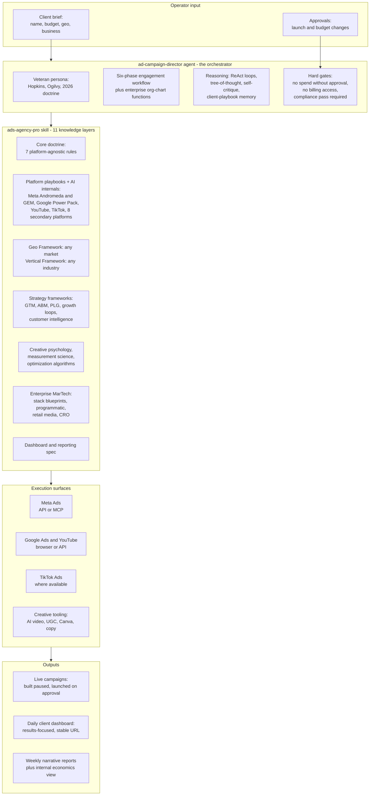
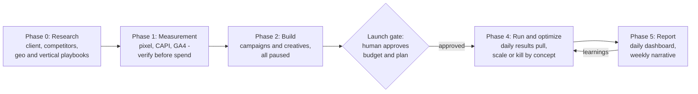

# Ad-Campaign Skills

**Production-grade paid-media agents & skills for [Claude Code](https://claude.com/claude-code)
— any region, any industry.**

Give the flagship agent a four-line client brief — *client name, budget, location, nature of
business* — and it plans and executes a complete ad campaign across **Meta (Facebook +
Instagram), Google, YouTube, and TikTok**: research → strategy → conversion tracking →
campaign build → human-approved launch → daily optimization → a daily client results
dashboard.

Built from real agency work, generalized for the world, released under MIT.

> **Version 2.2** — enterprise-grade: adds GTM/ABM/PLG strategy frameworks, customer
> intelligence, MarTech stack architecture (CDP/CRM/consent/identity), programmatic +
> retail media, deep CRO, and advanced agent reasoning (ReAct, tree-of-thought,
> self-critique) — on top of v2.1's AI-marketing brain (platform AI internals, measurement
> science, optimization algorithms) and v2.0's global geo + vertical frameworks.
> See [CHANGELOG.md](CHANGELOG.md).

---

## Architecture



### How a campaign actually runs



---

## What's inside

```
ad-campaign-director/
├── README.md                        # Detailed agent docs: install, usage, examples
├── agents/
│   └── ad-campaign-director.md      # The agent: persona, workflow, hard gates
└── skills/
    └── ads-agency-pro/
        ├── SKILL.md                 # Agency OS: doctrine, quick sheets, workflow, guardrails
        └── references/
            ├── platforms-2026.md            # Meta Andromeda, Google Power Pack, YouTube, TikTok
            ├── geo-playbooks.md             # Geo Framework + all world regions + 6 worked examples
            ├── vertical-playbooks.md        # Vertical Framework + 12 industries + 4 worked examples
            ├── client-dashboard-spec.md     # Daily client dashboard: layout, metrics, narrative
            ├── marketing-foundations.md     # 28 disciplines, journey models, objective matrix
            ├── creative-psychology.md       # Creative rubric, 12 copy frameworks, psychology
            ├── platform-ai-internals.md     # Meta GEM/Andromeda + Google auction math, 8 more platforms
            ├── measurement-science.md       # Attribution (incl. Markov/Shapley), experiments, MMM
            ├── optimization-automation.md   # Budget/bid algorithms, creative bandit, lifecycle, ecom
            ├── strategy-frameworks.md       # GTM, ABM tiers, PLG/growth loops, customer intelligence
            └── enterprise-martech.md        # Stack blueprints, programmatic, retail media, CRO
```

## Why this exists

Most "AI marketing" tooling either writes generic copy or dumps platform docs on you. This
project encodes **how a senior agency operator actually thinks**:

- **Creative is the targeting now.** Meta's Andromeda and TikTok's Smart+ retrieve ads by
  creative signal. The playbooks force concept diversity (10-15 distinct concepts per
  campaign) instead of audience micro-management.
- **Frameworks over lists.** You don't get six markets — you get a 7-question framework that
  builds a playbook for ANY market, with nine regional guides and six full worked examples
  showing the target depth. Same for industries: a 6-question framework, 12 quick guides,
  four deep examples.
- **Money is gated.** The agent builds everything paused and cannot activate spend, raise
  budgets, or touch billing without explicit human approval. Ever.
- **Honest reporting is doctrine.** Misses get reported as misses, with cause and corrective
  action. Dashboards lead with the question the client actually has: *is it working?*

## Install

**Option A — Claude Code plugin marketplace (recommended):**

Run these in an interactive Claude Code session:

```
/plugin marketplace add rghrmkr1993/ad-campaign-skills
/plugin install ad-campaign-director@ad-campaign-skills
```

**Option B — manual copy:**

```bash
git clone https://github.com/rghrmkr1993/ad-campaign-skills.git
cd ad-campaign-skills

# agent
cp ad-campaign-director/agents/ad-campaign-director.md ~/.claude/agents/

# skill
cp -r ad-campaign-director/skills/ads-agency-pro ~/.claude/skills/
```

Windows (PowerShell):

```powershell
Copy-Item ad-campaign-director\agents\ad-campaign-director.md "$env:USERPROFILE\.claude\agents\"
Copy-Item -Recurse ad-campaign-director\skills\ads-agency-pro "$env:USERPROFILE\.claude\skills\"
```

Restart your Claude Code session; the agent and skill register automatically.

**Optional companions** (recommended for full power):
- [claude-ads](https://github.com/AgriciDaniel/claude-ads) — structured audits + gated account ops across 12 platforms
- A Meta Ads MCP connector — direct API access instead of browser automation
- Marketing skill packs (copywriting, CRO, analytics)

## Usage

Any region, any industry — the same four-line brief:

```
Run ads for: GlowLeaf Skincare • ₹1.5L/month • Tamil Nadu + Kerala • ayurvedic skincare D2C
Run ads for: Bytewise • $8k/month • US + UK • B2B SaaS, dev-tools
Run ads for: Casa Bonita • R$20k/month • São Paulo • home-decor e-commerce
Run ads for: Almasa Dates • AED 30k/month • UAE + KSA • premium gifting F&B
```

The agent researches, plans, builds paused campaigns, and asks for **one explicit approval**
before any money moves. During live flights, schedule a daily run:

```
daily update for GlowLeaf
```

…and it refreshes the client dashboard and flags anomalies.

## Customize

1. Fill in the **account registry** in `skills/ads-agency-pro/SKILL.md` with your own accounts.
2. Run the **Geo Framework** (7 questions) for your active markets; the six worked examples
   show the target depth.
3. Run the **Vertical Framework** (6 questions) for your client industries.
4. Platform mechanics are research-dated **July 2026** — algorithms drift; refresh
   `platforms-2026.md` periodically.

## Safety design

| Gate | Behavior |
|---|---|
| Spend | Everything is built PAUSED; activation, budget raises, and fund additions require explicit human approval with a presented diff |
| Payments | The agent never enters payment credentials or touches billing/tax fields |
| Platform availability | Verified per geo every planning cycle (e.g., TikTok is banned in India) |
| Compliance | Regulated verticals (health claims, finance, housing…) pass a claims checklist before every creative upload |
| Reporting | The operator always sees full economics; client dashboards follow the contract |

## Versioning

Semantic-ish: **2.0.0** current. See [CHANGELOG.md](CHANGELOG.md). More agents will land in
this repo as sibling folders.

## Contributing

Issues and PRs welcome — especially: updated platform mechanics, new worked-example markets
and verticals, benchmark refreshes, and translations of creative-code notes. Keep the
structure: framework first, quick guides second, worked examples third.

## Disclaimers

- Not affiliated with Meta, Google, TikTok, or any platform. Platform policies and benchmark
  figures change — verify against official documentation before spending real money.
- Nothing here is financial, legal, or compliance advice. Regulated-category advertisers
  should get professional review.
- You are responsible for how campaigns run in your accounts. The agent's hard gates help,
  but the human approving the spend owns the outcome.

## License

MIT — see [LICENSE](LICENSE).
