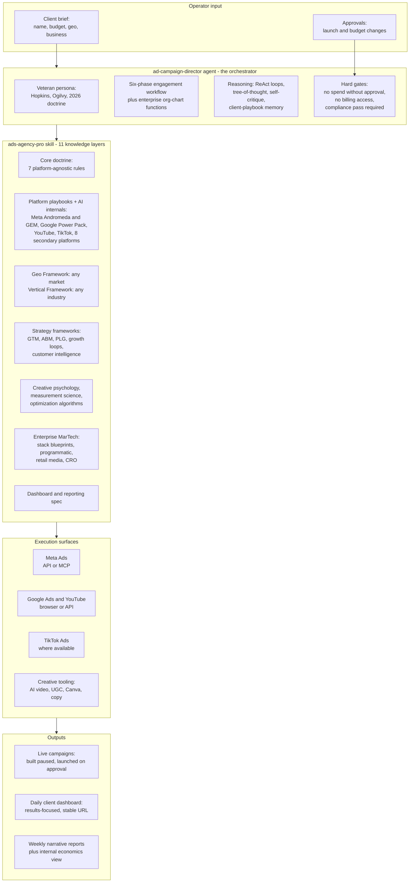
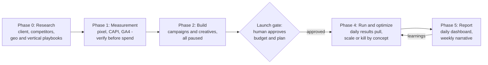

# Ad-Campaign Skills

[](https://github.com/rghrmkr1993/ad-campaign-skills/releases)
[](LICENSE)
[](https://claude.com/claude-code)
[]()

**Production-grade paid-media agents & skills for [Claude Code](https://claude.com/claude-code)
— complete ad campaigns for any industry, in any region of the world, from a four-line
client brief.**

```
Run ads for: GlowLeaf Skincare • ₹1.5L/month • Tamil Nadu + Kerala • ayurvedic skincare D2C
```

That single line is a full engagement: the agent researches the client and competitors,
writes a benchmark-cited strategy, verifies conversion tracking end-to-end, builds
campaigns and creative concepts in a paused state, asks for **one explicit human approval**
before any money moves, then optimizes daily and maintains a daily client dashboard.

Built from real agency work. Generalized for the world. Released under MIT.

---

## Table of contents

- [Why this exists](#why-this-exists)
- [Architecture](#architecture)
- [How a campaign runs](#how-a-campaign-runs)
- [What's inside](#whats-inside)
- [The knowledge stack (11 layers)](#the-knowledge-stack-11-layers)
- [Install](#install)
- [Quick start](#quick-start)
- [Daily operations](#daily-operations)
- [Customize for your agency](#customize-for-your-agency)
- [Safety design](#safety-design)
- [Client reporting models](#client-reporting-models)
- [FAQ](#faq)
- [Versions](#versions)
- [Roadmap](#roadmap)
- [Contributing](#contributing)
- [Disclaimers](#disclaimers)

---

## Why this exists

Most "AI marketing" tooling either writes generic copy or dumps platform documentation on
you. This project encodes **how a senior agency operator actually thinks**, structured the
way enterprise marketing platforms structure their internal systems:

- **Creative is the targeting now.** Meta's Andromeda/GEM and TikTok's Smart+ retrieve ads
  by creative signal, not audience settings. The playbooks force conceptual diversity
  (10-15 distinct concepts per campaign) instead of audience micro-management.
- **Frameworks over lists.** You don't get six markets — you get a 7-question Geo Framework
  that builds a playbook for ANY market (with 9 regional guides and 6 full worked
  examples). Same for industries: a 6-question Vertical Framework, 12 quick guides, 4 deep
  examples.
- **The platform's AI is the executor; the agent is the strategist.** The skill documents
  how Meta's auction (`Total Value ≈ Bid × Estimated Action Rate + User Value − Negative
  Feedback`) and Google's Ad Rank actually decide — and the steering doctrine that follows:
  improve the machine's inputs, never arm-wrestle its math.
- **Money is gated.** Everything builds paused. Spend activation, budget raises, and fund
  additions each require explicit human approval. Every time.
- **Honest reporting is doctrine.** Misses get reported as misses, with cause and
  corrective action. Incrementality beats click-attribution claims. Dashboards answer the
  client's only real question — *is it working?* — in five seconds.

## Architecture



## How a campaign runs



| Phase | What happens | Spend? |
|---|---|---|
| 0 — Research | Client footprint, competitor ad libraries (Meta Ads Library, Google Transparency Center), geo + vertical playbooks, strategy brief with benchmark-cited targets | No |
| 1 — Measurement | Pixel + Conversions API, Google tag + enhanced conversions, GA4, feed health; test events verified end-to-end. **No tracking = no launch** | No |
| 2 — Build | Consolidated, broad, language-split structures; 10-15 creative concepts; compliance pass for regulated verticals. **Everything created PAUSED** | No |
| 3 — Launch gate | Launch summary presented (structure, daily budgets, flights, creatives, targets); activates only on explicit approval | 🔒 Gated |
| 4 — Run & optimize | Daily results + dashboard update; scale winners +20-30% steps; kill losing *concepts* (not variations); 25-30% creative refresh every 2 weeks; no panic moves inside the 7-10 day learning window | Approved |
| 5 — Report | Daily client dashboard + weekly 5-part narrative (90-second executive summary → KPI scorecard → cause-and-effect → insights → next actions) | — |

## What's inside

```
ad-campaign-skills/
├── README.md                        # You are here
├── CHANGELOG.md                     # Version history
├── LICENSE                          # MIT
├── .claude-plugin/
│   └── marketplace.json             # Claude Code plugin marketplace manifest
└── ad-campaign-director/
    ├── README.md                    # Deep-dive agent docs: mental model, phases, FAQ
    ├── .claude-plugin/
    │   └── plugin.json              # Plugin manifest
    ├── agents/
    │   └── ad-campaign-director.md  # The agent: persona, workflow, org chart, gates
    └── skills/
        └── ads-agency-pro/
            ├── SKILL.md             # Agency OS: doctrine, quick sheets, workflow, guardrails
            └── references/          # The 11 knowledge layers (below)
```

## The knowledge stack (11 layers)

| # | File | What it teaches the agent |
|---|---|---|
| 1 | `SKILL.md` (core doctrine) | The 7 rules of 2026 paid media: creative-is-the-targeting, concepts not variations, consolidated structure, broad beats narrow, signal quality, video-first, patience windows |
| 2 | `platforms-2026.md` | Meta Andromeda-era playbook (A+SC, Entity-ID mechanics, fatigue math), Google Power Pack budget splits (PMax / AI Max / Demand Gen), YouTube three-surface strategy (in-stream / Shorts / CTV), TikTok Smart+ and GMV Max, cross-platform budget starting points |
| 3 | `platform-ai-internals.md` | How the machines decide: Meta's two brains (Andromeda retrieval + GEM LLM-scale ranking) and auction math; Google's Ad Rank and Smart Bidding auction-time signals; the steering doctrine; objective maps for Microsoft, LinkedIn, TikTok, Pinterest, Snapchat, Reddit, Amazon, X |
| 4 | `geo-playbooks.md` | The 7-question Geo Framework (platform availability and bans, language maps, payment/commerce mechanics, festival calendars, privacy regimes, CPM tiers, creator ecosystems) + 9 regional guides covering every world region + 6 full-depth worked examples (India/South India, Sri Lanka, Malaysia, Singapore, US, UK) |
| 5 | `vertical-playbooks.md` | The 6-question Vertical Framework (claims/regulatory status, purchase cycle and unit economics, creative codes, benchmarks, measurement model, seasonality) + 12 industry quick guides + 4 worked examples (skincare/beauty compliance, fashion benchmarks, film release arc, tech/B2B) |
| 6 | `marketing-foundations.md` | 28 marketing disciplines mapped to when each leads, customer journey models (AIDA, TOFU/MOFU/BOFU, Flywheel, AARRR, See-Think-Do-Care, RACE), and the objective-selection matrix |
| 7 | `creative-psychology.md` | 10-point creative scoring rubric, 12 copywriting frameworks (PAS, BAB, FAB, 4P, QUEST, StoryBrand, PASTOR…), persuasion psychology (Cialdini, loss aversion, anchoring, framing, peak-end) with explicit ethical lines |
| 8 | `measurement-science.md` | Metric health logic (MER vs platform ROAS, LTV:CAC), 9 attribution models (last-click → Markov chains → Shapley → incrementality as ground truth), experiment designs (A/B, Bayesian, geo experiments, lift tests, holdouts, budget stair-steps), honest forecasting and MMM |
| 9 | `optimization-automation.md` | The agent's own decision algorithms: marginal budget allocation, 70/30 explore-exploit, bidding selection tree, creative-bandit rotation, scale/kill thresholds, lifecycle automation journeys, ecommerce feed intelligence |
| 10 | `strategy-frameworks.md` | Go-to-Market 5-step (ICP → positioning → pricing → channels → launch motion), ABM tiers (1:1 / 1:few / 1:many), PLG and growth loops, business-model mechanics, customer intelligence (personas with the verbatim-quote rule, RFM, cohorts, health scores, VoC mining) |
| 11 | `enterprise-martech.md` | MarTech stack blueprints sized by client tier (CRM vs CDP vs DMP), event-tracking architecture, programmatic plumbing (DSP → OpenRTB → SSP, PMPs, header bidding, CTV) with honest spend thresholds, retail media (Amazon, Walmart, Flipkart, Shopify Audiences), CRO deep-dive |

Plus `client-dashboard-spec.md` — the daily client dashboard: 5-second-rule layout, metric
rules for both reporting models, narrative style, update pipeline.

## Install

**Option A — Claude Code plugin marketplace (recommended):**

Run in an interactive Claude Code session:

```
/plugin marketplace add rghrmkr1993/ad-campaign-skills
/plugin install ad-campaign-director@ad-campaign-skills
```

**Option B — manual copy:**

macOS/Linux:

```bash
git clone https://github.com/rghrmkr1993/ad-campaign-skills.git
cd ad-campaign-skills
cp ad-campaign-director/agents/ad-campaign-director.md ~/.claude/agents/
cp -r ad-campaign-director/skills/ads-agency-pro ~/.claude/skills/
```

Windows (PowerShell):

```powershell
git clone https://github.com/rghrmkr1993/ad-campaign-skills.git
cd ad-campaign-skills
Copy-Item ad-campaign-director\agents\ad-campaign-director.md "$env:USERPROFILE\.claude\agents\"
Copy-Item -Recurse ad-campaign-director\skills\ads-agency-pro "$env:USERPROFILE\.claude\skills\"
```

Restart your Claude Code session; the agent and skill register automatically.

**Optional companions** (recommended for full power):
- [claude-ads](https://github.com/AgriciDaniel/claude-ads) — structured audits + gated account ops across 12 platforms
- A Meta Ads MCP connector — direct API access instead of browser automation
- Marketing skill packs (copywriting, CRO, analytics)

## Quick start

Any region, any industry — the same four-line brief:

```
Run ads for: GlowLeaf Skincare • ₹1.5L/month • Tamil Nadu + Kerala • ayurvedic skincare D2C
Run ads for: Bytewise • $8k/month • US + UK • B2B SaaS, dev-tools
Run ads for: Casa Bonita • R$20k/month • São Paulo • home-decor e-commerce
Run ads for: Almasa Dates • AED 30k/month • UAE + KSA • premium gifting F&B
Run ads for: Kiwi Trails • NZ$12k/month • Australia + NZ • adventure travel bookings
```

What you'll see: a strategy brief with assumptions stated → tracking verification → paused
campaign builds → ONE approval request → daily operation.

## Daily operations

During live flights:

```
daily update for <client>     # pulls fresh results, updates the dashboard, flags anomalies
weekly report for <client>    # 5-part narrative report
```

Tip: schedule the daily line as a recurring task so the dashboard refreshes every morning
without you thinking about it.

## Customize for your agency

1. **Account registry** — fill the table in `skills/ads-agency-pro/SKILL.md` with your own
   ad accounts and billing notes. Never run client work from personal ad accounts.
2. **Geo playbooks** — run the 7-question Geo Framework for your active markets; the six
   worked examples show the target depth.
3. **Vertical playbooks** — run the 6-question Vertical Framework for your client
   industries; regulated categories get the compliance checklist treatment.
4. **Reporting model** — pick per client (results-focused vs full-transparency) per the
   dashboard spec; the client contract always wins.
5. **Freshness** — platform mechanics are research-dated **July 2026**; algorithms drift.
   Refresh `platforms-2026.md` and `platform-ai-internals.md` quarterly.

## Safety design

| Gate | Behavior |
|---|---|
| Spend | Everything builds PAUSED; activation, budget raises, fund additions each require explicit human approval with a presented diff |
| Payments & billing | The agent never enters payment credentials or touches billing/tax fields |
| Platform availability | Verified per geo every planning cycle (e.g., TikTok is banned in India — Reels/Shorts take that budget) |
| Compliance | Regulated verticals (health claims, finance, housing…) pass a claims checklist before every creative upload |
| Learning windows | No structural changes inside the 7-10 day learning phase except tracking breakage, policy rejections, or pacing disasters |
| Reporting | The operator always sees full economics; misses are reported as misses with cause and corrective action |

## Client reporting models

The dashboard spec supports two models — **the client contract always decides**:

- **Results-focused** (fixed-fee / outcome engagements): the client buys deliverables and
  outcomes; the dashboard shows revenue, orders, leads, conversion rate, reach, engagement,
  trends, and creative winners.
- **Full-transparency** (pass-through media): the client pays ad spend directly; the
  dashboard includes spend, ROAS, CPA alongside results.

Either way the operator keeps a complete internal view — spend, ROAS, CPA, margin, pacing.

## FAQ

**Does it spend money on its own?** No. Everything is built paused. Activation, budget
raises, and fund additions each require explicit approval with a presented diff.

**Which platforms does it need?** Whatever you have: Meta via MCP/API, Google via browser
automation or API, TikTok via browser. More connectors = less browser driving.

**My market or industry isn't in the examples.** That's the design: run the 7-question Geo
Framework and 6-question Vertical Framework — the worked examples show the depth to aim for.

**Are the benchmarks guaranteed?** No — they're research-dated (July 2026) category medians
for expectation-setting. Your account's own data supersedes them within weeks.

**Is this "trained ML"?** It's encoded operator knowledge + decision rules the agent
reasons with (RAG-style), steering the platforms' own trillion-parameter auction ML. The
skill documents exactly how those systems decide so the agent optimizes their inputs.

**Restricted categories (finance, health, housing)?** Supported, but the frameworks force
compliance checks — and platform special-category rules and local law apply to you. Get
professional review for regulated claims.

## Versions

| Version | Date | Highlights |
|---|---|---|
| 2.2.0 | 2026-07-19 | Enterprise expansion: GTM/ABM/PLG strategy, customer intelligence, MarTech architecture, programmatic + retail media, CRO deep-dive, advanced agent reasoning (ReAct, tree-of-thought, self-critique) |
| 2.1.1 | 2026-07-19 | Claude Code plugin marketplace support |
| 2.1.0 | 2026-07-19 | The AI-marketing brain: 5 knowledge layers + orchestrator protocol; Meta GEM coverage |
| 2.0.0 | 2026-07-18 | Global generalization: any region (Geo Framework), any industry (Vertical Framework), architecture docs |
| 1.0.0 | 2026-07-18 | Initial release: agent + skill, 6 markets, 4 verticals |

Full details in [CHANGELOG.md](CHANGELOG.md).

## Roadmap

- More agents in this repo (each in its own folder, one `marketplace.json` entry away)
- Quarterly platform-mechanics refreshes
- Additional worked-example markets and verticals (community contributions welcome)

## Contributing

Issues and PRs welcome — especially updated platform mechanics, new worked-example markets
and verticals, benchmark refreshes, and corrections from practitioners. Keep the structure:
framework first, quick guides second, worked examples third. One claim per line, dated
where it can drift.

## Disclaimers

- Not affiliated with Meta, Google, TikTok, Anthropic, or any platform. Platform policies
  and benchmark figures change — verify against official documentation before spending
  real money.
- Nothing here is financial, legal, or compliance advice. Regulated-category advertisers
  should get professional review.
- You are responsible for how campaigns run in your accounts. The agent's hard gates help,
  but the human approving the spend owns the outcome.

## License

MIT — see [LICENSE](LICENSE). Built with [Claude Code](https://claude.com/claude-code).
