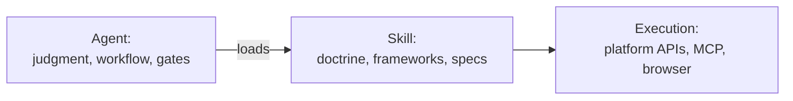

# Ad Campaign Director — Agent + Skill (Detailed Docs)

The flagship agent of [Ad-Campaign Skills](../README.md): a veteran paid-media **campaign
director** for Claude Code that runs complete client campaigns on **Meta, Google, YouTube,
and TikTok** — for **any industry, in any region of the world**.

---

## The mental model

Two pieces work together:

| Piece | File | Role |
|---|---|---|
| **Agent** | `agents/ad-campaign-director.md` | WHO is working: a 30-year-veteran persona, a 6-phase engagement workflow, and hard safety gates |
| **Skill** | `skills/ads-agency-pro/` | WHAT it knows: 2026 platform doctrine, the Geo Framework, the Vertical Framework, and the dashboard spec |



The agent's judgment is anchored in the masters — **Claude Hopkins** (advertising is
measured salesmanship; test everything; the customer is selfish) and **David Ogilvy** (the
hook is 80% of the ad; respect the consumer; kill campaigns on data, not boredom) — fused
with **2026 platform reality** (creative-based retrieval, consolidated structures, signal
quality, learning windows).

## The 6-phase workflow

| Phase | What happens | Spend? |
|---|---|---|
| 0 — Research | Client footprint, competitor ad libraries (Meta Ads Library, Google Transparency Center), geo playbook via the Geo Framework, vertical playbook via the Vertical Framework, strategy brief with benchmark-cited targets | No |
| 1 — Measurement | Pixel + Conversions API, Google tag + enhanced conversions, GA4, feed health. Test events verified end-to-end. **No tracking = no launch** | No |
| 2 — Build | Campaign structures (consolidated, broad, language-split), 10-15 creative concepts, compliance pass for regulated verticals. **Everything created PAUSED** | No |
| 3 — Launch gate | Launch summary presented: structure, daily budgets, flight dates, creatives, targets. Activates only on explicit approval | 🔒 Gated |
| 4 — Run & optimize | Daily results pull + dashboard update; scale winners +20-30% steps; kill losing *concepts* (not variations); 25-30% creative refresh every 2 weeks; no panic moves inside the 7-10 day learning window | Yes (approved) |
| 5 — Report | Daily client dashboard + weekly 5-part narrative report (90-second executive summary → KPI scorecard → cause-and-effect → insights → next actions) | — |

## What the skill contains

### 1. Core doctrine (7 rules)
Creative is the targeting • concepts not variations • consolidate structure • broad beats
narrow • signal quality is the moat • video-first • patience windows.

### 2. Platform playbooks (`references/platforms-2026.md`)
- **Meta:** Andromeda mechanics (creative-based ad retrieval, Entity-ID collapse),
  Advantage+ Shopping as primary, EMQ ≥ 7, fatigue math.
- **Google:** the Power Pack — Performance Max + AI Max for Search + Demand Gen with budget
  splits per business type, Demand Gen's four official best-practice pillars.
- **YouTube:** three surfaces (in-stream / Shorts / CTV) with per-surface creative rules
  and CPM bands.
- **TikTok:** Smart+ automation, GMV Max for TikTok Shop, live shopping, per-geo
  availability checks.

### 3. The Geo Framework (`references/geo-playbooks.md`)
Seven questions that turn any market into a playbook: platform availability & bans •
language map • payment & commerce mechanics • seasonal calendar • privacy/compliance • CPM
tier & testing strategy • creator ecosystem.

Plus **nine regional quick guides** (North America, Latin America, Europe, Middle East &
GCC, Africa, South Asia, Southeast Asia, East Asia, Oceania) and **six worked examples**
built to full depth (India/South India, Sri Lanka, Malaysia, Singapore, US, UK).

### 4. The Vertical Framework (`references/vertical-playbooks.md`)
Six questions that turn any industry into a playbook: regulatory & claims status • purchase
cycle & unit economics • creative codes • benchmark bands • measurement model • seasonality.

Plus **twelve industry quick guides** (F&B, health & wellness, finance, real estate,
education, travel, automotive, gaming/apps, B2B/SaaS, local services, luxury, electronics)
and **four worked examples** built to full depth (skincare/beauty, fashion,
film/entertainment, tech).

### 5. Dashboard spec (`references/client-dashboard-spec.md`)
A daily client dashboard designed around the 5-second rule (*is it working?* answered
instantly): hero verdict tiles, trend charts titled as findings, funnel, creative
leaderboard, geo/language splits, and a "what we did / what's next" narrative. Supports
both reporting models — results-focused (fixed-fee contracts) and full-transparency
(pass-through media) — **the contract always wins**, and the operator always keeps a full
internal economics view.

### 6. The AI-marketing brain (v2.1)
`marketing-foundations.md` (28 disciplines, journey models, objective-selection matrix) •
`creative-psychology.md` (scoring rubric, 12 copywriting frameworks, persuasion ethics) •
`platform-ai-internals.md` (Meta Andromeda + GEM auction math, Google Ad Rank and Smart
Bidding signals, 8 secondary platforms) • `measurement-science.md` (9 attribution models,
experiment designs, honest forecasting) • `optimization-automation.md` (budget/bid
decisioning, creative-bandit rotation, scale/kill thresholds, lifecycle automation,
ecommerce intelligence).

### 7. Strategy + enterprise MarTech (v2.2)
`strategy-frameworks.md` (Go-to-Market 5-step, ABM tiers, PLG and growth loops,
business-model mechanics, customer intelligence) • `enterprise-martech.md` (MarTech stack
blueprints by client size, event-tracking architecture, programmatic plumbing
DSP/RTB/PMP/CTV, retail media, CRO deep-dive).

## Install

See the [root README](../README.md#install). Short version: copy
`agents/ad-campaign-director.md` to `~/.claude/agents/` and `skills/ads-agency-pro/` to
`~/.claude/skills/`, then restart your Claude Code session.

## Usage examples

```
Run ads for: GlowLeaf Skincare • ₹1.5L/month • Tamil Nadu + Kerala • ayurvedic skincare D2C
Run ads for: Bytewise • $8k/month • US + UK • B2B SaaS, dev-tools
Run ads for: Casa Bonita • R$20k/month • São Paulo • home-decor e-commerce
Run ads for: Almasa Dates • AED 30k/month • UAE + KSA • premium gifting F&B
Run ads for: Kiwi Trails • NZ$12k/month • Australia + NZ • adventure travel bookings
```

What you'll see: a strategy brief with assumptions stated → tracking verification → paused
campaign builds → ONE approval request → then daily operation.

During live flights:

```
daily update for <client>     # refreshes dashboard, flags anomalies
weekly report for <client>    # 5-part narrative report
```

## FAQ

**Does it spend money on its own?** No. Everything is built paused. Activation, budget
raises, and fund additions each require explicit approval with a presented diff.

**Which platforms does it need?** It works with whatever you have: Meta via MCP/API,
Google via browser automation or API, TikTok via browser. More connectors = less browser
driving.

**My market/industry isn't in the examples.** That's the point of v2.0 — run the 7-question
Geo Framework and 6-question Vertical Framework; the worked examples show the depth to aim
for.

**Are the benchmarks guaranteed?** No — they're research-dated (July 2026) category medians
for expectation-setting. Your account's data supersedes them within weeks.

**Can I use this for restricted categories (finance, health, housing)?** Yes, but the
frameworks will force compliance checks, and you should get professional review — platform
special-category rules and local law apply to you, not to this repo.
